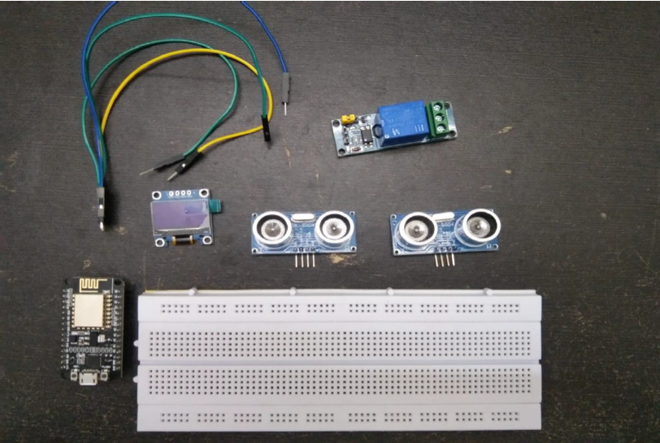
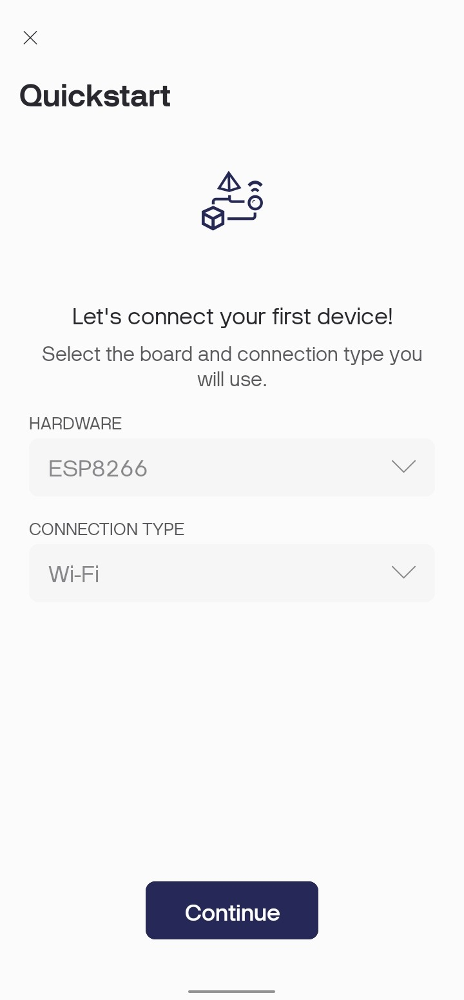
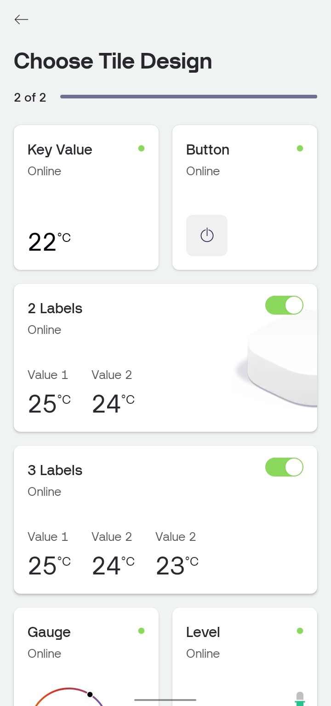
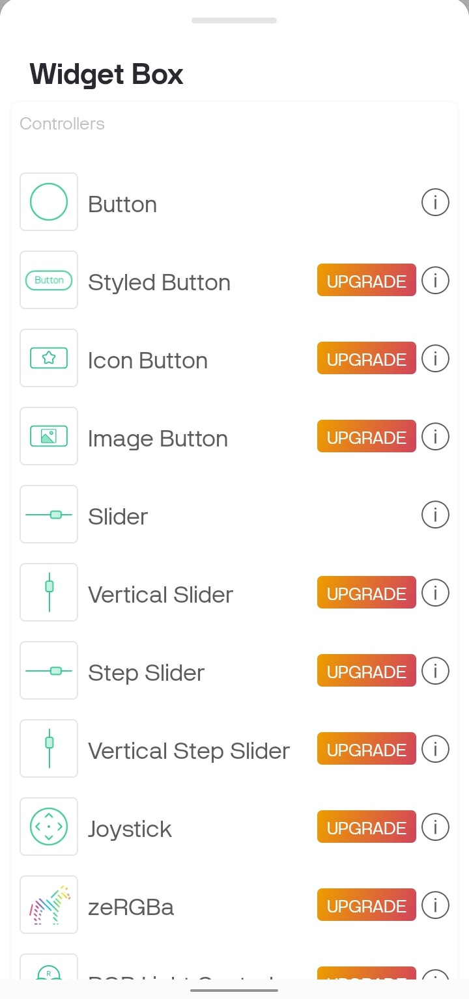
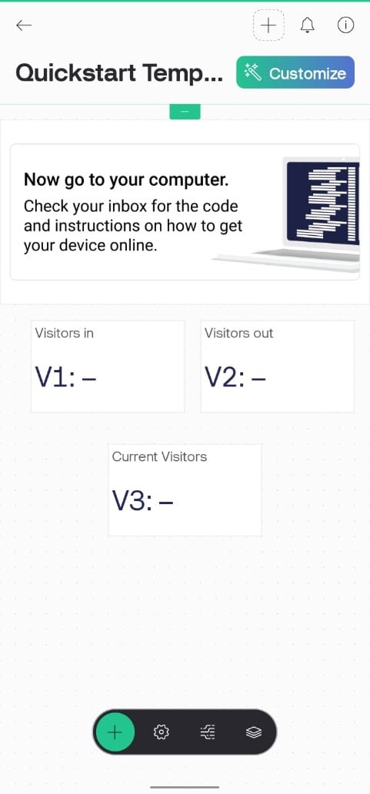
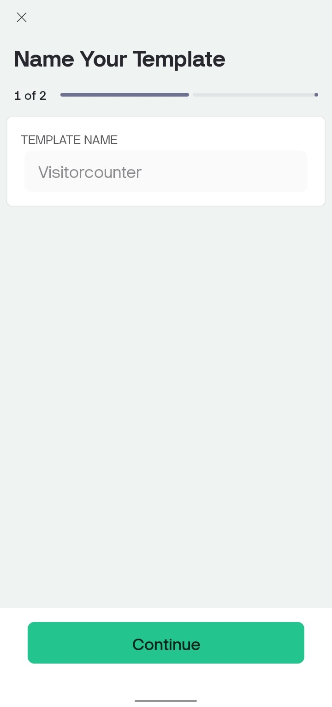
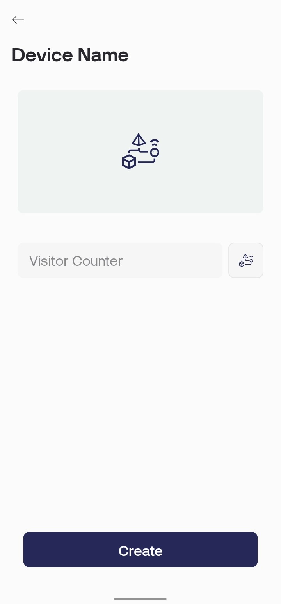
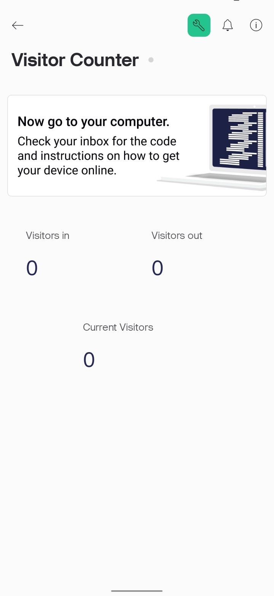
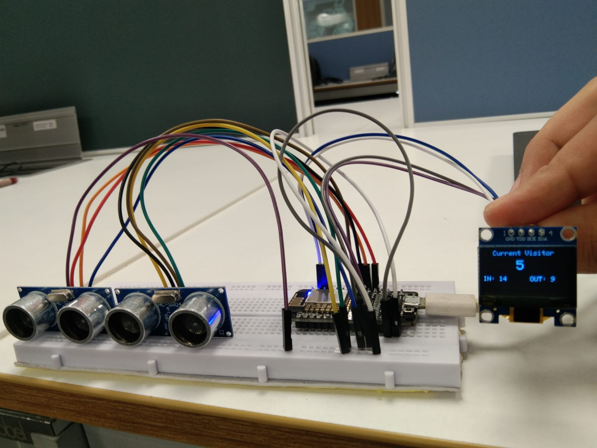

# Visitor Counter Project

## Table of Contents
<ol>
  <li>Overview</li>
  <li>Components required</li>
  <li>Libraries needed to be installed</li>
  <li>Module Development</li>
  <ul>
    <li>Connections</li>
    <li>Setting up Blynk Application</li>
  </ul>
  <li>Tests and Results</li>
  <li>Video Demonstration</li>
  <li>Conclusion</li>
</ol>

## Overview

This project enables real-time monitoring of the total number of incoming, outgoing, and current visitors. By utilizing Ultrasonic sensors, the system accurately counts and differentiates between incoming and outgoing visitors. The data is seamlessly uploaded to the Blynk cloud using the NodeMCU ESP8266 WiFi Module, allowing you to access and monitor the visitor data from anywhere in the world via the Blynk Dashboard.

 

The system uses two Ultrasoic sensors placed at the entrance to ensure accurate bidirectional counting. Sensor 1 is positioned at the beginning of the entrance, while Sensor 2 is placed slightly after Sensor 1 along the path of entry/exit. The counting logic is straightforward: an entry is detected when a person crosses Sensor 1 followed by Sensor 2, while an exit is detected when a person crosses Sensor 2 followed by Sensor 1. To ensure accurate counting, the system only registers a count when the sequence of sensor activations matches the predefined patterns for entry or exit, thereby preventing partial crossings (e.g., a person walking halfway through and then stepping back) from being counted.

## Components Required
<table>
  <tr align="center">
    <th>
      Sr. no.
    </th>
    <th>
      Component names
    </th>
    <th>
      Quantity
    </th>
  </tr>
  <tr align="center">
    <td>
      1.
    </td>
    <td>
      NodeMCU ESP8266
    </td>
    <td>
      1
    </td>
  </tr>
  <tr align="center">
    <td>
      2.
    </td>
    <td>
      HC-SR04 Sensors
    </td>
    <td>
      2
    </td>
  </tr>
  <tr align="center">
    <td>
      3.
    </td>
    <td>
      OLED Display
    </td>
    <td>
      1
    </td>
  </tr>
  <tr align="center">
    <td>
      4.
    </td>
    <td>
      Jumper Wires
    </td>
    <td>
      As per requirement
    </td>
  </tr>
  <tr align="center">
    <td>
      5.
    </td>
    <td>
      Breadboard
    </td>
    <td>
      1
    </td>
  </tr>
  <tr align="center">
    <td>
      6.
    </td>
    <td>
      Relay Module
    </td>
    <td>
      1
    </td>
  </tr>
</table>

 

 

## Libraries needed to be installed
1. ESP8266 library for the ESP8266 microcontroller board.
2. OLED Display Library: Adafruit SSD1306 and Adafruit GFX Library.
3. ESP8266WiFi Library
4. BlynkSimpleEsp8266 Library for connecting with the Blynk IoT platform.

## Module Development
### Contections
1. Connect the I2C pins (SDA & SCL) of 0.96" OLED Display  with the NodeMCU ESP8266 D2 and D1 respectively.
2. Interface the trigger pin and echo pin of ultrasonic sensor 1 to the D6 and D5 respectively of ESP8266.
3. Interface the trigger pin and echo pin of ultrasonic sensor 2 to the D8 and D7 respectively of ESP8266.
4. Connect a 5V Relay module to the D3 pin of ESP8266.

### Setting up Blynk Application

We need to set up the Blynk app to receive the visitor counter data from the ESP8266 NodeMCU board. To set up Blynk Application, Download and install the application on smartphone. Open the app and create a new account using e-mail address.

1. Click on create a new project.
2. Create a new tempelate and name it.

3. Choose Tile Design

4.Search the “Value Display” widget from widget box and add 3 of them to your main screen.

5. Now set the input pins to virtual pins V1, V2 and V3, Enter the range and choose the refresh rate as 1 sec. 
6. Choose NodeMCU ESP8266 Dev board. 
7. Select connection type as WiFi, then click on create button.

8. Enter the device name.

9. Finally, the Blynk App setup for IoT based person counter using NodeMCU ESP8266 is completed.

## Tests and Results

After uploading the Visitor Counter code to the NodeMCU ESP8266 board, the device is ready to use. The system uses two Ultrasoic sensors placed at the entrance to ensure accurate bidirectional counting. Sensor 1 is positioned at the beginning of the entrance, while Sensor 2 is placed slightly after Sensor 1 along the path of entry/exit. The counting logic is straightforward: an entry is detected when a person crosses Sensor 1 followed by Sensor 2, while an exit is detected when a person crosses Sensor 2 followed by Sensor 1. To ensure accurate counting, the system only registers a count when the sequence of sensor activations matches the predefined patterns for entry or exit, thereby preventing partial crossings (e.g., a person walking halfway through and then stepping back) from being counted.

 

  

## Video Demonstration
